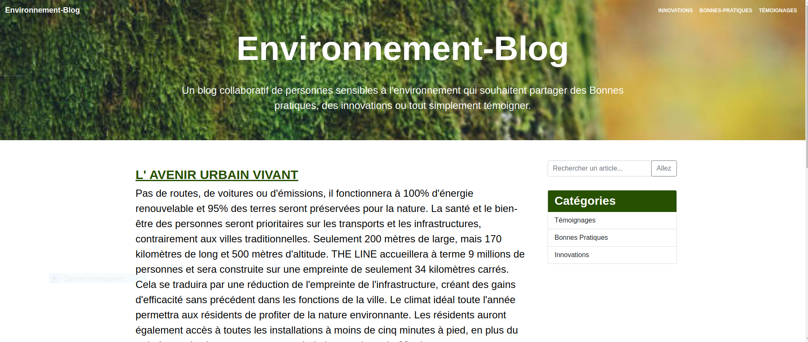

# environnement-blog

Blog on the subject of the environment. The aim is to share innovations, good practices or simply testimonials on environmental issues.

The application is fully responsive and has been developed with PHP, CSS, Bootstrap, an MVC structure and object-oriented programming.

We have a MariaDB database, with adminer interface SQL.

